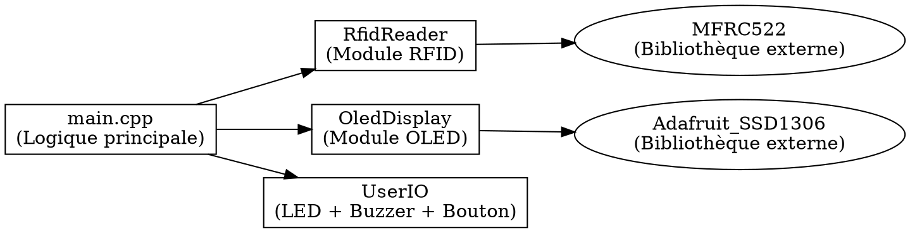

[](index.html)

*Projet : ESP32 RFID + OLED + UserIO (Système Ecommerce Studio Photo)*
*Version : 1.0 — Documentation interne*
---

# 1. **Vue d’ensemble**

Ce document constitue la documentation technique interne du firmware ESP32 utilisé dans le système *Ecommerce Studio Photo*. Il décrit l’architecture logicielle, la conception matérielle, les modules fonctionnels, les standards de programmation et les procédures de test et validation.

Ce projet permet :

* la lecture de tags RFID Ultralight via MFRC522 ;
* l’extraction du SKU depuis un JSON embarqué dans la mémoire RFID ;
* l’affichage sur OLED ;
* un retour utilisateur LED+buzzer ;
* une validation via bouton ;
* un envoi du SKU au système hôte via UART.

---

# 2. **Objectif fonctionnel**

Le système lit un tag RFID associé à une chaussure, affiche son SKU et le transmet au PC. Il sert de module d’identification dans un pipeline automatisé de capture photo 360° pour produits e-commerce.

---

# 3. **Architecture logicielle**

## 3.1. Diagramme UML


*(Si l’image n’existe pas encore, générer avec le fichier DOT suivant → docs/uml/architecture.dot)*



---

# 4. **Structure du projet**

```
project/
│
├── include/
│    └── Config.h
│
├── src/
│    ├── main.cpp
│    ├── RfidReader.h / .cpp
│    ├── UserIO.h / .cpp
│    ├── OledDisplay.h / .cpp
│
├── docs/
│    ├── html/       ← documentation Doxygen générée
│    ├── uml/        ← diagrammes UML
│    └── Doxyfile
│
└── platformio.ini
```

---

# 5. **Installation & Compilation**

Ce firmware utilise **PlatformIO**.

## 5.1. Compilation

```bash
pio run
```

## 5.2. Flash ESP32

```bash
pio run -t upload
```

## 5.3. Moniteur série

```bash
pio device monitor
```

---

# 6. **Documentation Doxygen**

Badge Doxygen (à placer en haut du README si désiré) :

```

```

## Générer la documentation

```bash
doxygen docs/Doxyfile
```

Sortie :

```
docs/html/index.html
```

---

# 7. **Modules logiciels**

## 7.1. Module RFID — `RfidReader`

Responsabilités :

* initialisation du MFRC522
* détection PICC
* lecture Ultralight page par page
* extraction sécurisée du SKU via JSON
* gestion des erreurs via `std::optional`
* reconstruction de chaîne sécurisée

Caractéristiques techniques :

* buffer MFRC522 = 18 octets
* arrêt lecture si `0x00` détecté
* `std::optional<String>` pour validité
* détection de pages invalides

---

## 7.2. Module OLED — `OledDisplay`

Responsabilités :

* initialiser l’écran SSD1306
* afficher du texte centré automatiquement
* gestion d’erreur critique en cas d’écran absent
* effacement + affichage atomique

---

## 7.3. Module UserIO — `UserIO`

Responsabilités :

* LED_POWER (témoin de vie)
* LED_CONN (connexion série PC)
* LED_OP (feedback RFID)
* BUZZER (feedback sonore)
* bouton utilisateur (validation)

Fonctions :

* `InitUserIO()`
* `SetConnLed()`
* `PulseOpFeedback()`
* `WaitForButtonPress()`

Le bouton utilise INPUT_PULLUP et une logique inversée.

---

## 7.4. Logique principale — `main.cpp`

Séquence complète :

1. Initialisation UserIO
2. Initialisation OLED
3. Initialisation RFID
4. Affichage “Lecture active”
5. Détection RFID
6. Feedback LED+buzzer
7. Lecture des pages
8. Extraction JSON
9. Affichage SKU
10. Transmission via UART
11. Validation par bouton

---

# 8. **Normes de programmation**

Normes appliquées :

* **UpperCamelCase** : fonctions, classes, types
* **lowerCamelCase** : variables
* **UPPER_CASE** : constantes globales
* objets passés par **const &**
* types triviaux passés par copie
* utilisation de **constexpr** au lieu de `#define`
* interdiction d’utiliser `using namespace std;`
* documentation complète Doxygen
* fonctions sans effet secondaire non documenté
* aucun littéral magique dans le code → centralisation dans `Config.h`

---

# 9. **Séquence opérationnelle détaillée**

| Étape | Description                              |
| ----- | ---------------------------------------- |
| 1     | Système sous tension (LED_POWER ON)      |
| 2     | Initialisation OLED & RFID               |
| 3     | Affichage “Lecture active”               |
| 4     | Présentation d’un tag                    |
| 5     | LED_OP + buzzer confirment l’acquisition |
| 6     | Lecture Ultralight page par page         |
| 7     | Extraction JSON (`"id":"xxx"`)           |
| 8     | Affichage du SKU                         |
| 9     | Transmission UART                        |
| 10    | Validation par bouton                    |
| 11    | Retour à l’état d’attente                |

---

# 10. **Gestion des erreurs**

| Erreur           | Détection                  | Action            |
| ---------------- | -------------------------- | ----------------- |
| OLED absent      | InitOled() = false         | Blocage permanent |
| RFID non lisible | RfidReadRaw() = nullopt    | “Erreur lecture”  |
| SKU absent       | ExtractSku() = nullopt     | “Aucun SKU”       |
| Tag absent       | PICC non détecté           | retour loop()     |
| PC absent        | Serial n’a aucune activité | LED_CONN clignote |

---

# 11. **Tests et validation**

## 11.1. Tests unitaires

* lecture tag valide
* lecture multiple du même tag
* lecture d’un tag court
* lecture d’un tag sans champs JSON
* test du bouton
* test feedback buzzer
* test affichage OLED
* test robustesse MFRC522

## 11.2. Tests de robustesse

* rotation et orientation du tag
* variation de distance de lecture
* cycle d’alimentation rapide (“brown-out”)
* bruit électromagnétique
* test intensif (500 lectures consécutives)

---

# 12. **Risques techniques connus**

* MFRC522 faible puissance antenne → orientation critique
* OLED dépendant de l’alimentation stable
* bouton mécanique → rebonds matériels
* UART à haut débit → besoin de monitoring PC robuste
* dépendance au format JSON stocké dans RFID

---

# 13. **Améliorations possibles**

* migration vers PN532 (plus fiable)
* ajout watchdog hardware
* implémentation d’un protocole série structuré
* support d’un bouton capacitif
* animations LED avancées (non bloquantes)
* passage à FreeRTOS si extensions futures

---

# 14. **PlatformIO — configuration**

Exemple :

```ini
[env:esp32dev]
platform = espressif32
board = esp32dev
framework = arduino
monitor_speed = 921600
build_flags = 
    -std=gnu++17
    -Wall
    -Wextra
    -Wpedantic
```

---

# 15. **Schéma matériel**

## Connexions principales

| Élément     | Broche ESP32 |
| ----------- | ------------ |
| MFRC522 SS  | 5            |
| MFRC522 RST | 15           |
| LED_POWER   | 2            |
| LED_CONN    | 27           |
| LED_OP      | 12           |
| BUZZER      | 14           |
| BUTTON      | 34           |
| OLED SDA    | 21           |
| OLED SCL    | 22           |

---

# 16. **Annexes**

## 16.1. Fichier DOT UML (architecture.dot)

```dot
digraph Architecture {
    rankdir=LR;

    Main [label="main.cpp\n(Logique principale)", shape=box]

    RFID [label="RfidReader\n(Module RFID)", shape=box]
    OLED [label="OledDisplay\n(Module OLED)", shape=box]
    USERIO [label="UserIO\n(LED + Buzzer + Bouton)", shape=box]

    MFRC522 [label="MFRC522\n(Bibliothèque externe)", shape=ellipse]
    SSD1306 [label="Adafruit_SSD1306\n(Bibliothèque externe)", shape=ellipse]

    Main -> RFID
    Main -> OLED
    Main -> USERIO

    RFID -> MFRC522
    OLED -> SSD1306
}

